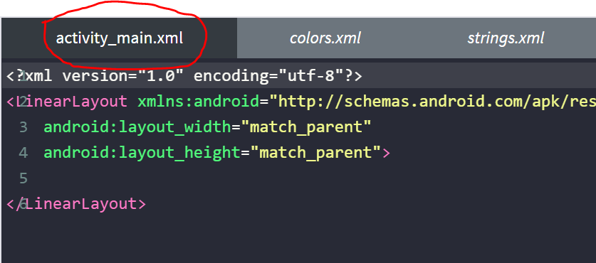
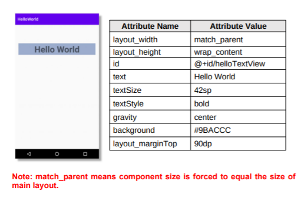
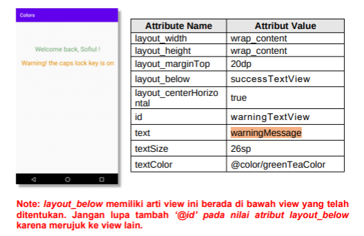

# 01 - LINEAR LAYOUT - HELLO WORLD

## Tujuan Pembelajaran

1. Mahasiswa akan membuat halaman login sederhana menggunakan
LinearLayout. Pertama kita belajar membuat hello-world dengan
TextView pada Linear Layout.

## Hasil Praktikum

1. Buka tab activity_main.xml.

    **Jawab :**

    Pada gambar dibawah merupakan tab activity_main.xml

    

2. Buat sebuah vertikal LinearLayout dengan id “helloActivity” sebagai layout utama, lalu tambahkan atribut di dalamnya.

    
    

    **Jawab :**

    

3. Di dalam tag Linear Layout utama, tambahkan sebuah TextView dengan id “helloTextView”. lalu tambahkan atribut di dalamnya.

    
    

    **Jawab :**

    

4. Tambahkan satu lagi TextView dengan id “secondTextview”, Di dalam tag Linear Layout utama.

    

    **Jawab :**

    

    [contoh link](../../src/01_pengantar/hello.js)

# 02 - LINEAR LAYOUT - EMAIL & PASSWORD

## Tujuan Pembelajaran

1. Mahasiswa mengetahui cara membuat komponen yang dapat menerima masukan dari pengguna dengan menggunakan EditText. Ini adalah dasar untuk membuat halaman yang membutuhkan masukan dari pengguna, seperti halaman login.

## Hasil Praktikum

1. Buka tab activity_main.xml.
2. Buat vertikal LinearLayout dengan id “editActivity” sebagai layout utama, lalu tambahkan atributnya.

    
    

    **Jawab :**

    

3. Di dalam tag Linear Layout utama,tambah sebuah EditText dengan id “emailEditText”. lalu tambahkan atributnya.

    

    **Jawab :**

    

4. Tambahkan sebuah EdiText dengan id “passwordEditText”, di dalam tag Linear Layout utama.lalu tambahkan atributnya.

    

    **Jawab :**

    

# 03 - LINEAR LAYOUT - EXIT & LOGIN BUTTON

## Tujuan Pembelajaran

1. Mahasiswa akan belajar bagaimana cara membuat tombol sederhana untuk aksi pengguna. Tombol exit untuk keluar dari halaman dan tombol login untuk melakukan login. Mari kita coba menggunakan horizontal linear layout.

## Hasil Praktikum

1. Buka tab activity_main.xml.
2. Buat horizontal LinearLayout dengan id “buttonActivity” sebagai layout utama, jangan lupa tambahkan margin kanan dan margin kiri pada layout utama. lalu tabahkan atributnya.

    
    

    **Jawab :**

    

3. Di dalam tag Linear Layout utama, tambahkan sebuah exit Button dengan id “exitButton”. lalu tabahkan atributnya.

    

    **Jawab :**

    

4. Tambahkan login Button dengan id “loginButton”, Di dalam tag Linear Layout utama setelah tombol exit

    

    **Jawab :**

    

# 04 - LINEAR LAYOUT - NESTED VIEW

## Tujuan Pembelajaran

1. Mahasisiwa mampu membuat komponen bersarang, horizontal linear layout pada vertikal linear layout

## Hasil Praktikum

1. Buka tab activity_main.xml. 

2. Buat vertikal LinearLayout dengan id “nestedViewActivity” sebagai layout utama, lalu tambahkan atributnya.

    

    **Jawab :**

    

3. Didalam tag Linear Layout utama, tambahkan TextView dengan id
“textView1”. lalu tambahkan atributnya.

    

    **Jawab :**

    

4. Tambahkan komponent Horizontal LinearLayout dengan id “nestedView”, di dalam tag Linear Layout utama.

    

    **Jawab :**

    

5. Tambahkan sebuah Button exit dengan id “exitButton” di dalam tag horizontal LinearLayout. lalu tambahkan atributnya.

    

    **Jawab :**

    

6. Tambahkan sebuah Button login dengan id “loginButton” di dalam tag horizontal LinearLayout.

    

    **Jawab :**

    

# 05 - LINEAR LAYOUT - LOGIN BUTTON

## Tujuan Pembelajaran

1. Siswa akan membuat halaman login sederhana berdasarkan materi yang telah dipelajari sebelumnya. Dalam topik terakhir tentang linear layout ini, akan terlihat jelas apa yang telah kita pelajari

## Hasil Praktikum

1. Buka tab activity_main.xml. 

2. Buat sebuah vertikal LinearLayout dengan id “loginActivity” sebagai layout utama. lalu tabahkan atributnya.

    

    **Jawab :**

    

3. Di dalam tag Linear Layout utama, Buat sebuah TextView untuk menampilkan teks “Login Page” dengan id “loginTextView”. Atur lebarnya sama seperti lebar layout induk (layout utama). lalu tabahkan atributnya.

    

    **Jawab :**

    

4. Tambahkan email EditText dengan id “emailEditText”, di dalam tag Linear Layout utama untuk menerima input dari pengguna.

    

    **Jawab :**

    

5. Tambahkan password EditText dengan id “passwordEditText”, disamping email EditText untuk menerima masukkan dari pengguna. Atur jenis masukan hanya untuk menerima kata sandi.

    

    **Jawab :**

    

6. Buat nested component/views untuk meletakkan tombol secara horizontal dari LinearLayout dengan id “nestedView”, di dalam tag linear layout utama setelah password EditText.

    

    **Jawab :**

    

7. Tambah exit Button dengan id “exitButton”, di dalam nestedView
LinearLayouts.

    

    **Jawab :**

    

8. Tambhakan login Button dengan id “loginButton”, di dalam nestedView LinearLayouts.

    

    **Jawab :**

    

# 06 - RELATIVE LAYOUT - STRINGS.XML

## Tujuan Praktikum

1. Mahasiswa mengetahui bagaimana cara menggunakan sumber daya string untuk teks sebuah komponen.

## Hasil Praktikum

1. Buka tab strings.xml. 

2. Tambahkan sumber daya string seperti yang dijelaskan di bawah.

    

    **Jawab :**

    

3. Buka tab activity_main.xml. 

4. Buat sebuah RelativeLayout dengan id “stringActivity” sebagai layout utama, lalu tambahkan atributnya .

    

    **Jawab :**

    

5. Di dalam tag Relative Layout utama, buat sebuah TextView dengan id “helloWorldTextView”. Jangan ragu untuk mewarnai tampilan sesuka Anda. lalu tambahkan atributnya.

    

    **Jawab :**

    

6. Tambahkan satu lagi Textview dengan id “secondTextView” di bawah “helloWorldTextView” Textview. Jangan ragu untuk mewarnai tampilan sesuka Anda. lalu tambahkan atributnya .

    

    **Jawab :**

    

7. Tambahkan Button dengan id “learnButton” di bawah “secondTextView” Textview.

    

    **Jawab :**

    

# 07 - RELATIVE LAYOUT - COLORS.XML

## Tujuan Praktikum

1. Mahasiswa mengetahui cara menggunakan sumber daya string dan warna untuk textview.

## Hasil Praktikum

1. Open tab strings.xml.

2. Tambahkan sumber daya string seperti yang dijelaskan di bawah.

    

    **Jawab :**

    

3. Buka tab colors.xml

4. Tambahkan sumber daya warna seperti yang dijelaskan di bawah.

    

    **Jawab :**

    

5. Open tab activity_main.xml

6. Buat sebuah RelativeLayout dengan id “colorsActivity” sebagai layout utama, lalu tambahkan atributnya.

    

    **Jawab :**

    

7. Di dalam tag Relative Layout utama, buat sebuah TextView dengan id “successTextView”. TextView ini untuk memberi sambutan saat user berhasil masuk. Gunakan successMessage pada strings.xml. Ubah warna teks menjadi warna green tea mengacu pada colors.xml.

    

    **Jawab :**

    

8. Tambahkan TextView dengan id “warningTextView”. TextView ini untuk memberi peringatan kepada pengguna ketika tombol caps lock menyala. Gunakan warningMessage pada strings.xml. Ubah warna text menjadi warna yellow mayo mengacu pada colors.xml.

    

    **Jawab :**

    

9. Tambahkan TextView dengan id “alertTextView”. TextView ini berguna untuk memperingatkan pengguna ketika email tidak terdaftar. Gunakan alertMessage pada strings.xml. Ubah warna teks menjadi red chilli color mengacu pada colors.xml.

    

    **Jawab :**

    

# 08 - RELATIVE LAYOUT - IMAGEVIEW

## Tujuan Praktikum

1. Mahasiswa mengetahui cara menampilkan gambar menggunakan imageview

## Hasil Praktikum

1. Buka tab strings.xml. 

2. Tambahkan sumber daya string seperti yang dijelaskan di bawah.

    

    **Jawab :**

    

3. Buka tab colors.xml. 

4. Tambahkan sumber daya warna seperti yang dijelaskan di bawah.

    

    **Jawab :**

    

5. Buka tab activity_main.xml. 

6. Buatlah sebuah RelativeLayout dengan id “imageActivity” sebagai layout utama. Atur warna background menjadi warna red chilli mengacu pada colors.xml. Lalu tambahkan atributnya.

    

    **Jawab :**

    

7. Di dalam tag Relative Layout utama, buat sebuah ImageView dengan id “avatarImageView”. ImageView ini untuk menampilkan gambar sederhana dari sumber drawable bawaan. Lalu tambahkan atributnya.

    

    **Jawab :**

    

8. Tambahkan TextView dengan id “simpleTextView”. TextView ini untuk menampilkan teks sederhana dibawah ImageView. Gunakan simpleText mengacu pada strings.xml. Ubah warna teks menjadi white color mengacu pada colors.xml.

    

    **Jawab :**

    

