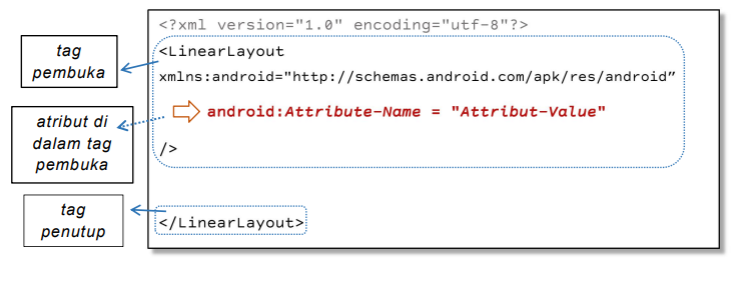
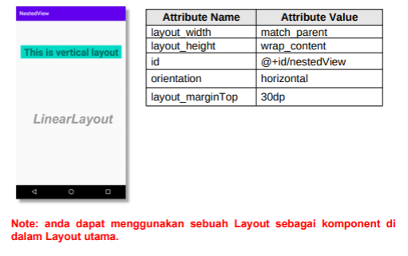

# 01 - LINEAR LAYOUT - HELLO WORLD

## Tujuan Pembelajaran

1. Mahasiswa akan membuat halaman login sederhana menggunakan
LinearLayout. Pertama kita belajar membuat hello-world dengan
TextView pada Linear Layout.

## Hasil Praktikum

1. Buka tab activity_main.xml.

    **Jawab :**

    Pada gambar dibawah merupakan tab activity_main.xml

    

2. Buat sebuah vertikal LinearLayout dengan id “helloActivity” sebagai layout utama, lalu tambahkan atribut di dalamnya.

    
    

    **Jawab :**

    

3. Di dalam tag Linear Layout utama, tambahkan sebuah TextView dengan id “helloTextView”. lalu tambahkan atribut di dalamnya.

    
    

    **Jawab :**

    

4. Tambahkan satu lagi TextView dengan id “secondTextview”, Di dalam tag Linear Layout utama.

    

    **Jawab :**

    

    [contoh link](../../src/01_pengantar/hello.js)

# 02 - LINEAR LAYOUT - EMAIL & PASSWORD

## Tujuan Pembelajaran

1. Mahasiswa mengetahui cara membuat komponen yang dapat menerima masukan dari pengguna dengan menggunakan EditText. Ini adalah dasar untuk membuat halaman yang membutuhkan masukan dari pengguna, seperti halaman login.

## Hasil Praktikum

1. Buka tab activity_main.xml.
2. Buat vertikal LinearLayout dengan id “editActivity” sebagai layout utama, lalu tambahkan atributnya.

    
    

    **Jawab :**

    

3. Di dalam tag Linear Layout utama,tambah sebuah EditText dengan id “emailEditText”. lalu tambahkan atributnya.

    

    **Jawab :**

    

4. Tambahkan sebuah EdiText dengan id “passwordEditText”, di dalam tag Linear Layout utama.lalu tambahkan atributnya.

    

    **Jawab :**

    

# 03 - LINEAR LAYOUT - EXIT & LOGIN BUTTON

## Tujuan Pembelajaran

1. Mahasiswa akan belajar bagaimana cara membuat tombol sederhana untuk aksi pengguna. Tombol exit untuk keluar dari halaman dan tombol login untuk melakukan login. Mari kita coba menggunakan horizontal linear layout.

## Hasil Praktikum

1. Buka tab activity_main.xml.
2. Buat horizontal LinearLayout dengan id “buttonActivity” sebagai layout utama, jangan lupa tambahkan margin kanan dan margin kiri pada layout utama. lalu tabahkan atributnya.

    
    

    **Jawab :**

    

3. Di dalam tag Linear Layout utama, tambahkan sebuah exit Button dengan id “exitButton”. lalu tabahkan atributnya.

    

    **Jawab :**

    

4. Tambahkan login Button dengan id “loginButton”, Di dalam tag Linear Layout utama setelah tombol exit

    

    **Jawab :**

    

# 04 - LINEAR LAYOUT - NESTED VIEW

## Tujuan Pembelajaran

1. Mahasisiwa mampu membuat komponen bersarang, horizontal linear layout pada vertikal linear layout

## Hasil Praktikum

1. Buka tab activity_main.xml. 

2. Buat vertikal LinearLayout dengan id “nestedViewActivity” sebagai layout utama, lalu tambahkan atributnya.

    

    **Jawab :**

    

3. Didalam tag Linear Layout utama, tambahkan TextView dengan id
“textView1”. lalu tambahkan atributnya.

    

    **Jawab :**

    

4. Tambahkan komponent Horizontal LinearLayout dengan id “nestedView”, di dalam tag Linear Layout utama.

    

    **Jawab :**

    

5. Tambahkan sebuah Button exit dengan id “exitButton” di dalam tag horizontal LinearLayout. lalu tambahkan atributnya.

    

    **Jawab :**

    

6. Tambahkan sebuah Button login dengan id “loginButton” di dalam tag horizontal LinearLayout.

    

    **Jawab :**

    