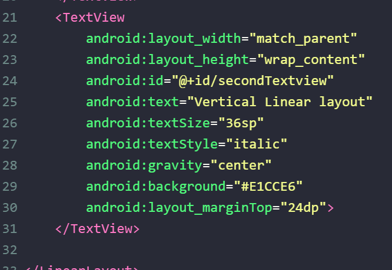

# 01 - LINEAR LAYOUT - HELLO WORLD

## Tujuan Pembelajaran

1. Mahasiswa akan membuat halaman login sederhana menggunakan
LinearLayout. Pertama kita belajar membuat hello-world dengan
TextView pada Linear Layout.

## Hasil Praktikum

1. Buka tab activity_main.xml.

    **Jawab :**

    Pada gambar dibawah merupakan tab activity_main.xml

    

2. Buat sebuah vertikal LinearLayout dengan id “helloActivity” sebagai layout utama, lalu tambahkan atribut di dalamnya.

    
    

    **Jawab :**

    

3. Di dalam tag Linear Layout utama, tambahkan sebuah TextView dengan id “helloTextView”. lalu tambahkan atribut di dalamnya.

    
    

    **Jawab :**

    

4. Tambahkan satu lagi TextView dengan id “secondTextview”, Di dalam tag Linear Layout utama.

    

    **Jawab :**

    

    [contoh link](../../src/01_pengantar/hello.js)