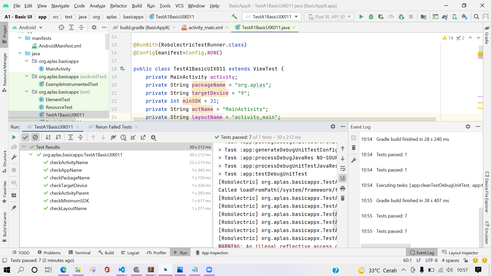
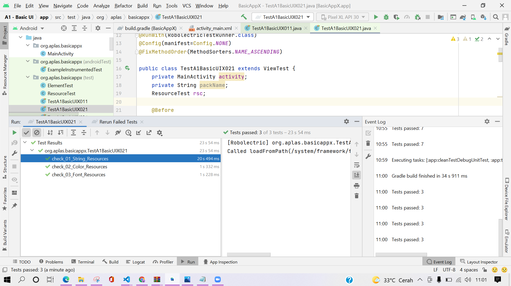
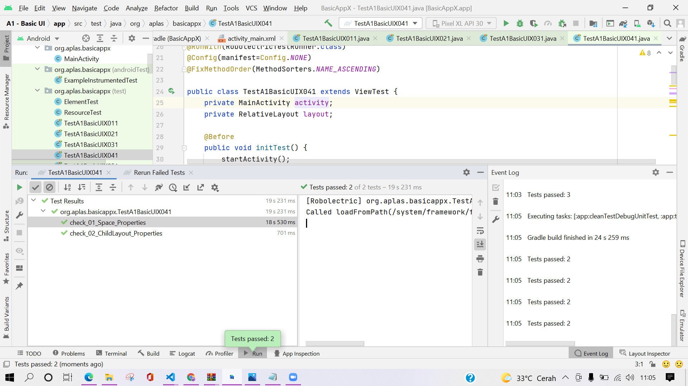
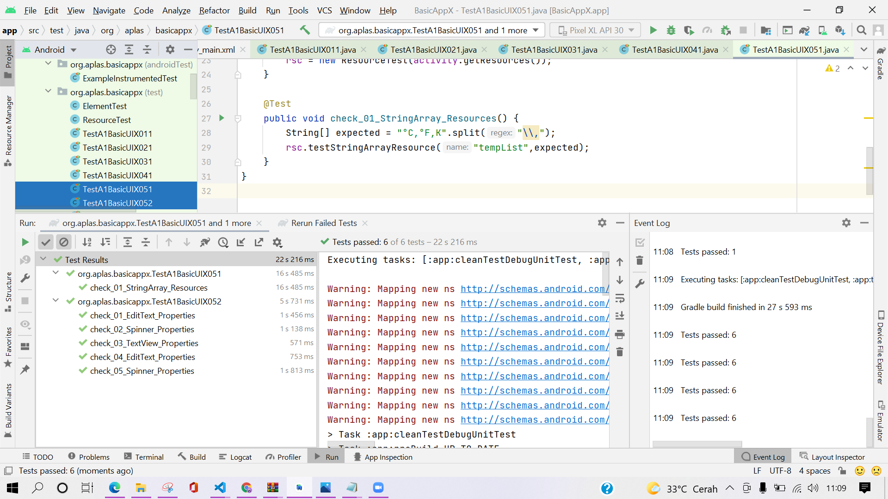
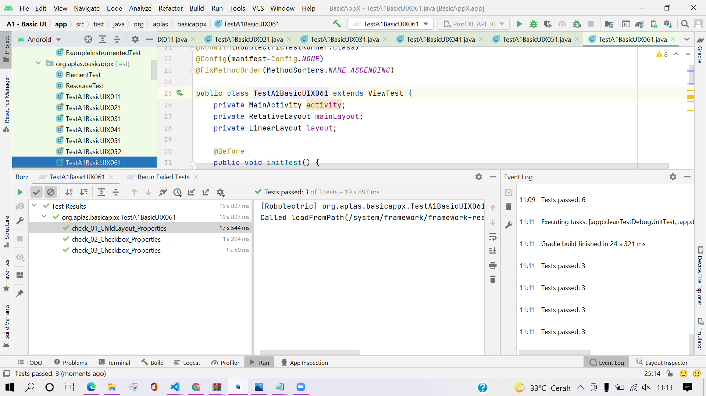
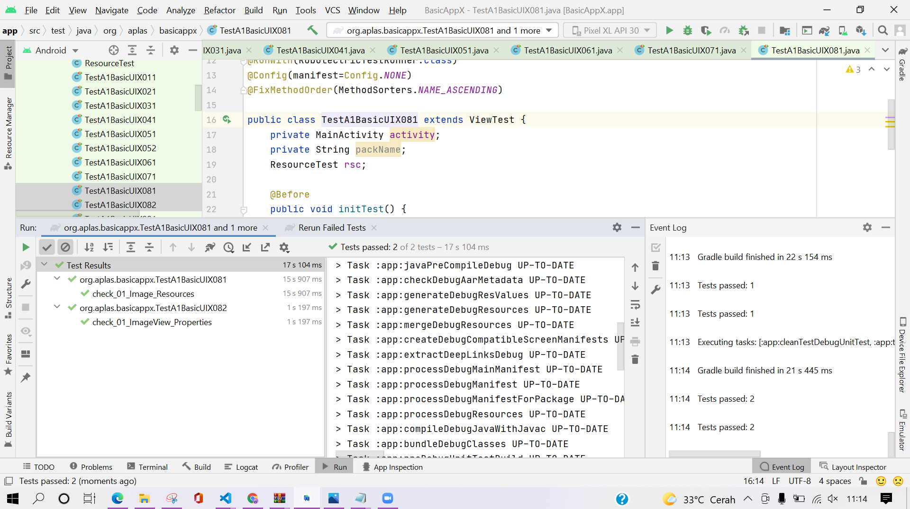
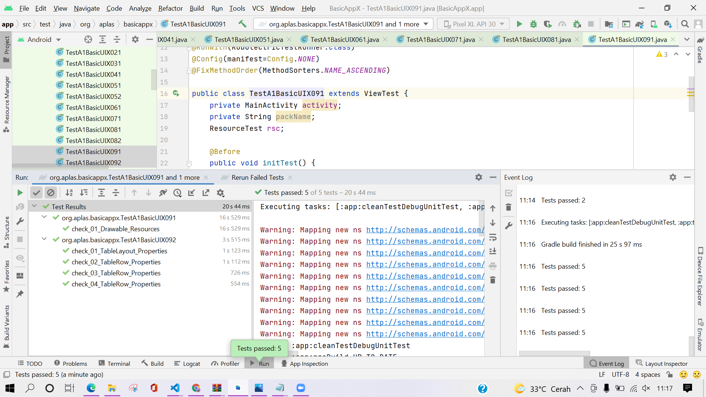
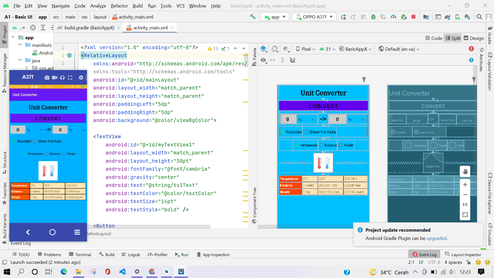

# A1 -TASK GUIDE (A1X.01)

## Tujuan Pembelajaran

1. Students know how to start an Android Studio Project with blank layout.

## Hasil Praktikum

# A1 - TASK GUIDE (A1X.02)

## Tujuan Pembelajaran

1. Students know how to configure Android Studio project resources, like string and font.

## Hasil Praktikum

# A1 - TASK GUIDE (A1X.03)

## Tujuan Pembelajaran

1. Students know how to design basic layout, add TextView, and add a Button.

## Hasil Praktikum

# A1 - TASK GUIDE (A1X.04)

## Tujuan Pembelajaran

1. Students know how to make Space and add Child Layout.

## Hasil Praktikum

# A1 - TASK GUIDE (A1X.05)

## Tujuan Pembelajaran

1. Students know how to configure color resources, make EditText, and Spinner.

## Hasil Praktikum

# A1 - TASK GUIDE (A1X.06)

## Tujuan Pembelajaran

1. Students know how to make CheckBox.

## Hasil Praktikum

# A1 - TASK GUIDE (A1X.07)

## Tujuan Pembelajaran

1. Students know how to make RadioGroup and RadioButton.

## Hasil Praktikum

# A1 - TASK GUIDE (A1X.08)

## Tujuan Pembelajaran

1. Students know how to add image resource and make an ImageView.

## Hasil Praktikum

# A1 - TASK GUIDE (A1X.09)

## Tujuan Pembelajaran

1. Students know how to add drawable resource and make a Table.

## Hasil Praktikum

# Hasil Akhir

