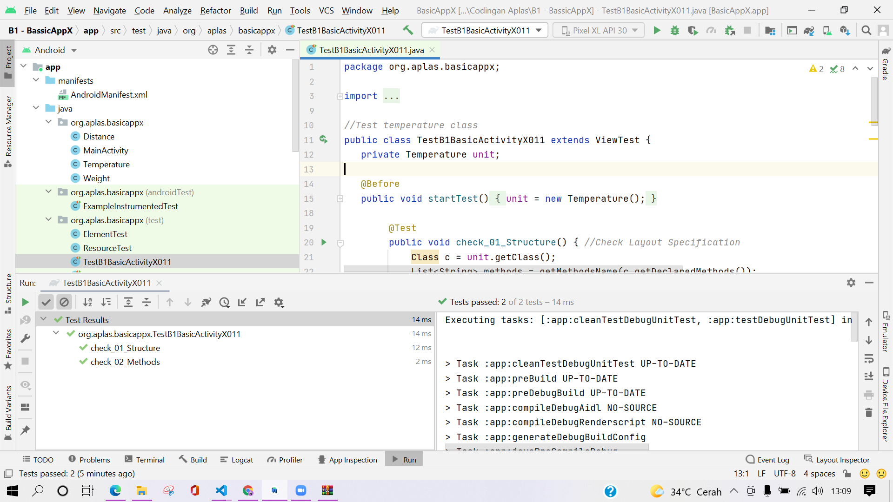
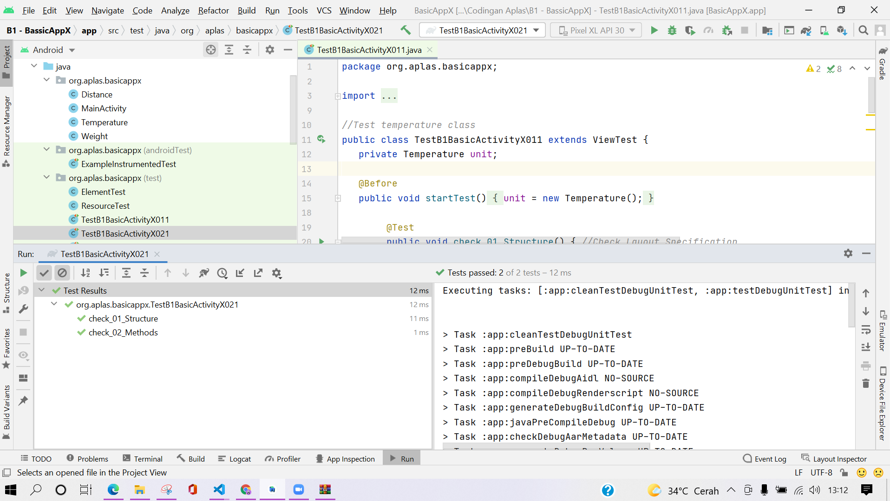
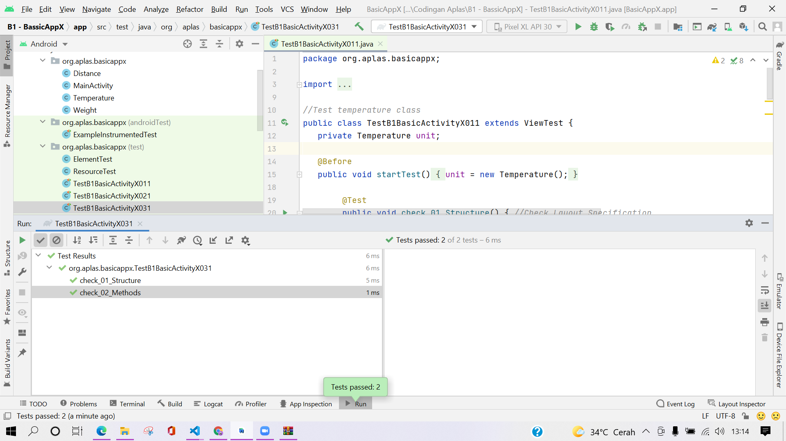
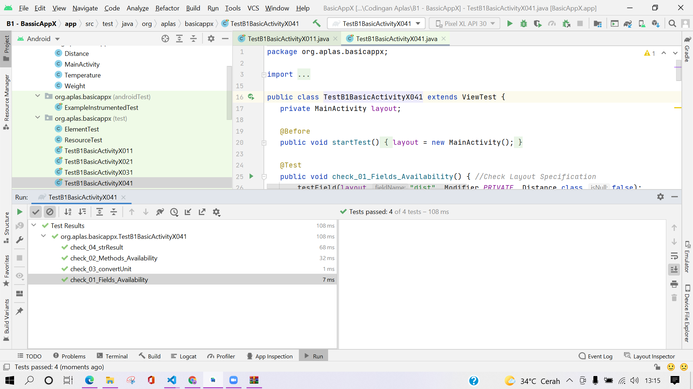
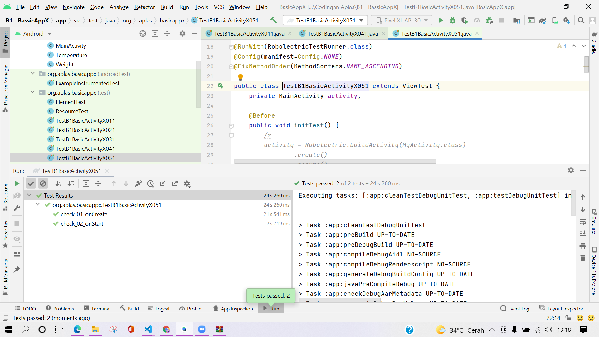
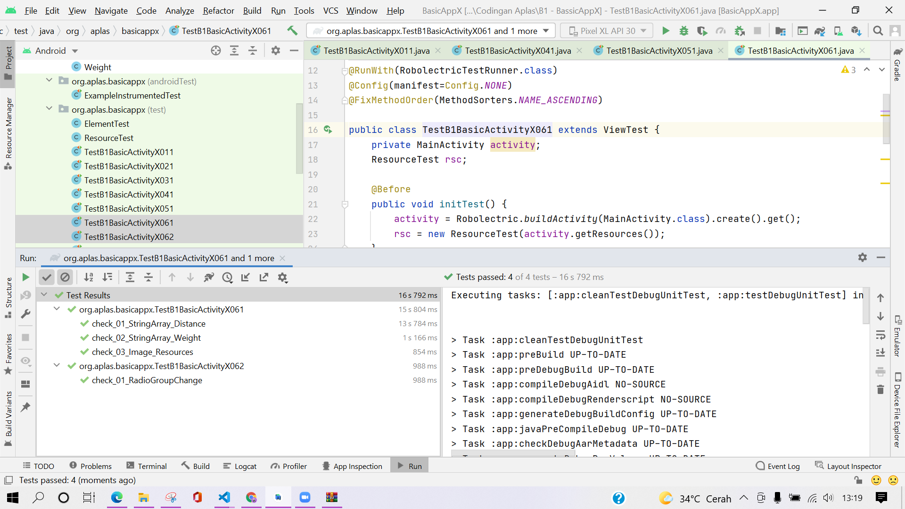
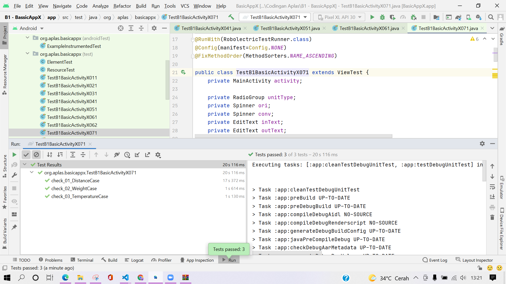
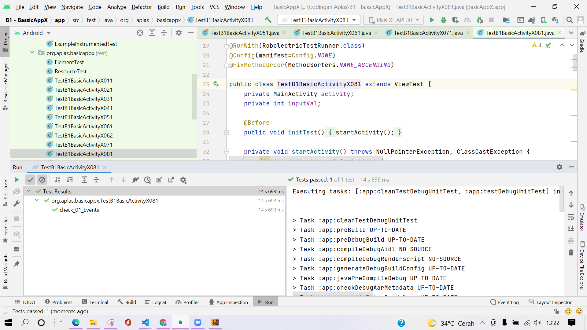
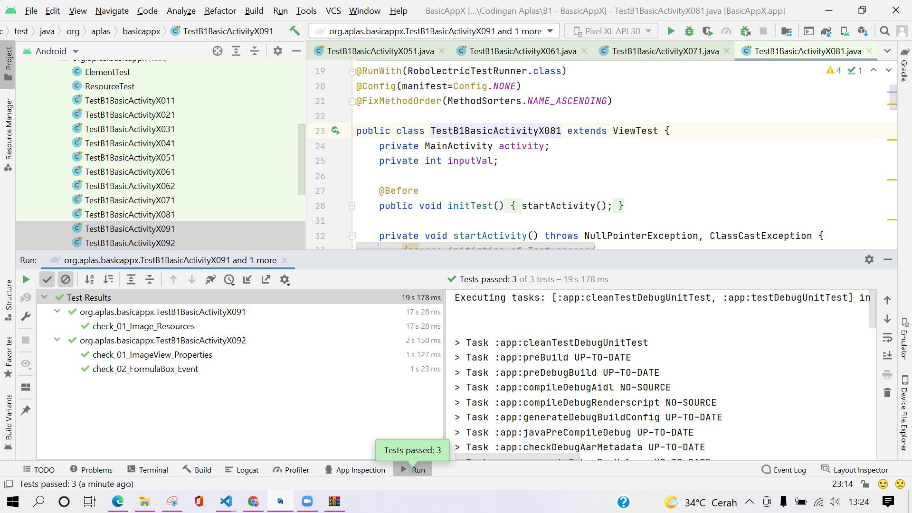

# B1 -TASK GUIDE (B1X.01)

## Tujuan Pembelajaran

1. Students create a Temperature class to convert unit.

## Hasil Praktikum

# B1 - TASK GUIDE (B1X.02)

## Tujuan Pembelajaran

1. Students create a Distance class to convert unit.

## Hasil Praktikum

# B1 - TASK GUIDE (B1X.03)

## Tujuan Pembelajaran

1. Students create a Weight class to convert unit.

## Hasil Praktikum

# B1 - TASK GUIDE (B1X.04)

## Tujuan Pembelajaran

1. Students can make fields and methods in main activity class.

## Hasil Praktikum

# B1 - TASK GUIDE (B1X.05)

## Tujuan Pembelajaran

1. Students understand about activity lifecycle when on Create and on Start.

## Hasil Praktikum

# B1 - TASK GUIDE (B1X.06)

## Tujuan Pembelajaran

1. Students understand about RadioGroup changed event and how to change Spinner content.

## Hasil Praktikum

# B1 - TASK GUIDE (B1X.07)

## Tujuan Pembelajaran

1. Students create a method to do conversion .

## Hasil Praktikum

# B1 - TASK GUIDE (B1X.08)

## Tujuan Pembelajaran

1. Make some events action for Button, Spinner, and CheckBox.

## Hasil Praktikum

# B1 - TASK GUIDE (B1X.09)

## Tujuan Pembelajaran

1. Students create a new image element and fill it when formula checkbox checked.

## Hasil Praktikum

