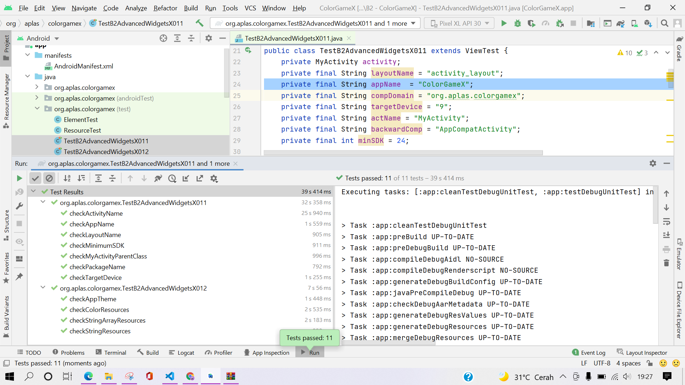
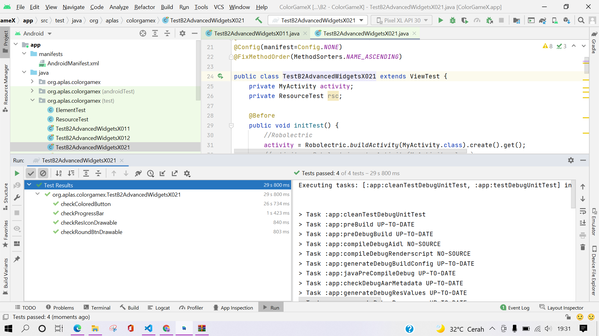
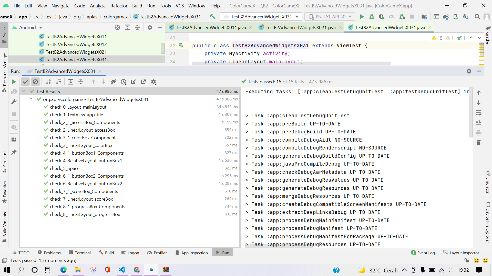
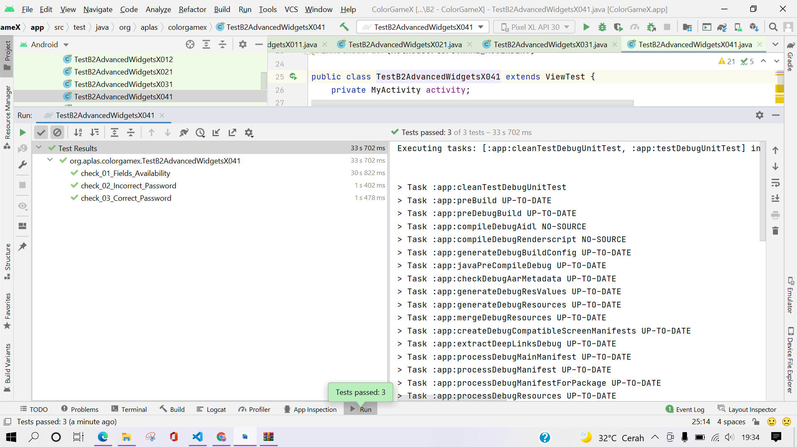
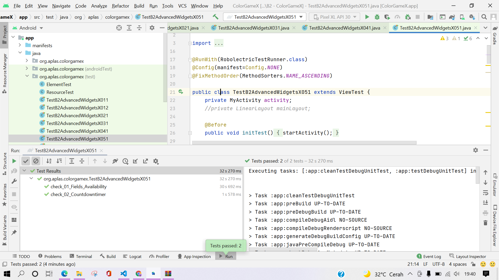
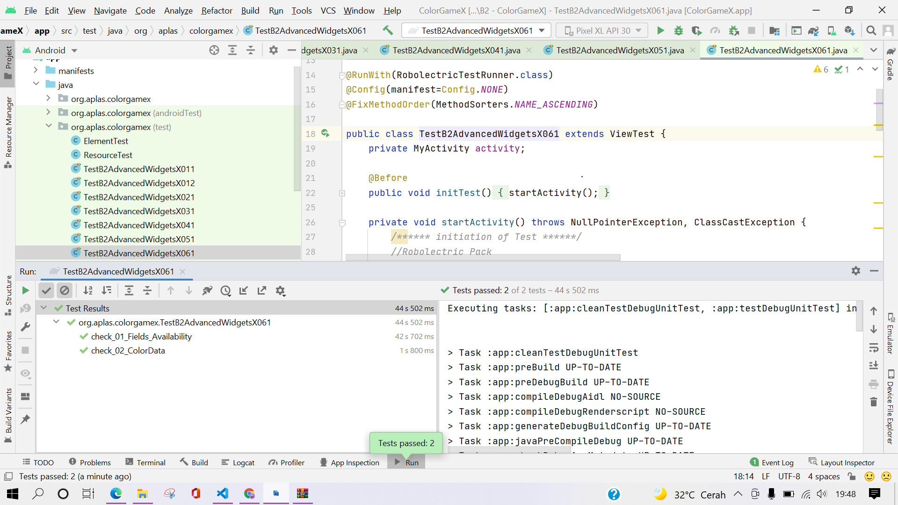
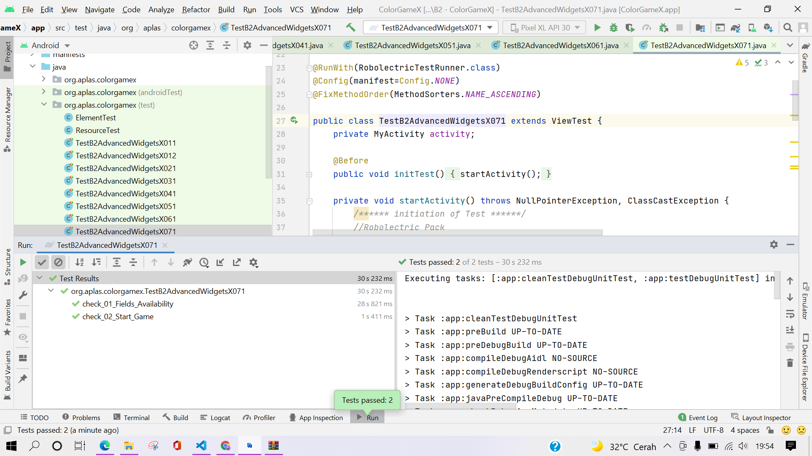
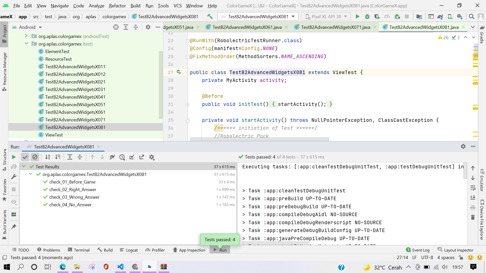
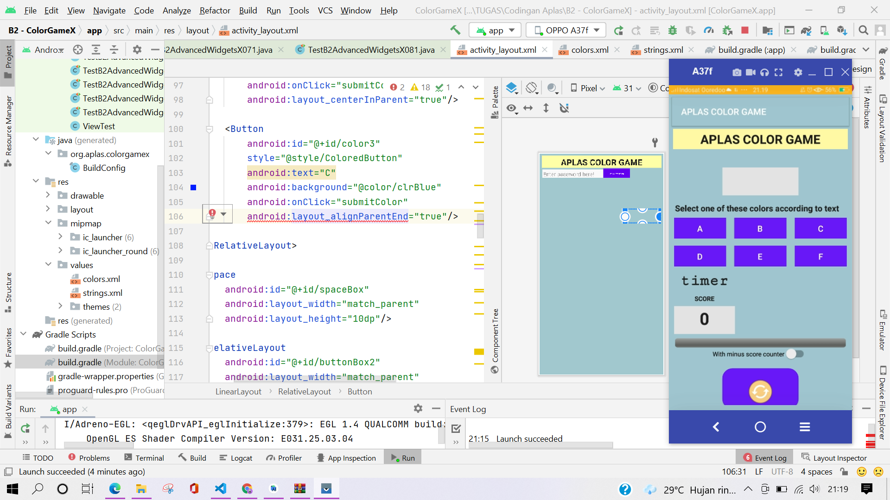

# B2 -TASK GUIDE (B2X.01)

## Tujuan Pembelajaran

1. Student will start the project to create simple game Android application. First with project configuration and resource configuration.

## Hasil Praktikum

# B2 -TASK GUIDE (B2X.02)

## Tujuan Pembelajaran

1. Student will understand about style, theme, and drawable vector image.

## Hasil Praktikum

# B2 -TASK GUIDE (B2X.03)

## Tujuan Pembelajaran

1. Student will make the UI for project of Color Game with some onClick attribute.

## Hasil Praktikum

# B2 -TASK GUIDE (B2X.04)

## Tujuan Pembelajaran

1. Student will declare fields needed by application and define method to check validity to enter the game.

## Hasil Praktikum

# B2 -TASK GUIDE (B2X.05)

## Tujuan Pembelajaran

1. Student will understand how Countdowntimer works.

## Hasil Praktikum

# B2 -TASK GUIDE (B2X.06)

## Tujuan Pembelajaran

1. Student will understand how access array from resource and put it into List and Hashtable.

## Hasil Praktikum

# B2 -TASK GUIDE (B2X.07)

## Tujuan Pembelajaran

1. Student will understand how start the timer to start the game.

## Hasil Praktikum

# B2 -TASK GUIDE (B2X.08)

## Tujuan Pembelajaran

1. Student will understand how to handle timer and calculate the score.

## Hasil Praktikum

# Hasil Akhir

