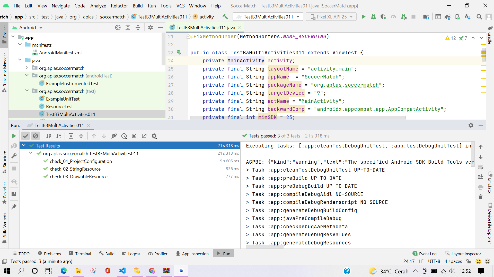
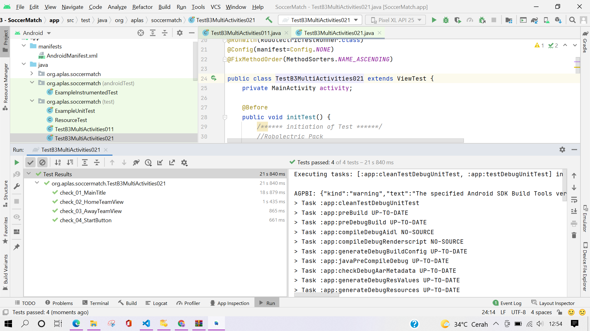
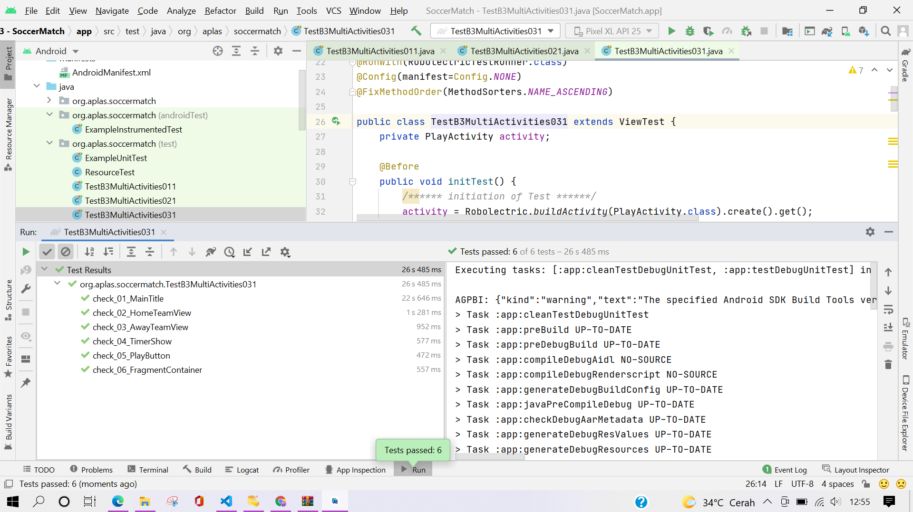
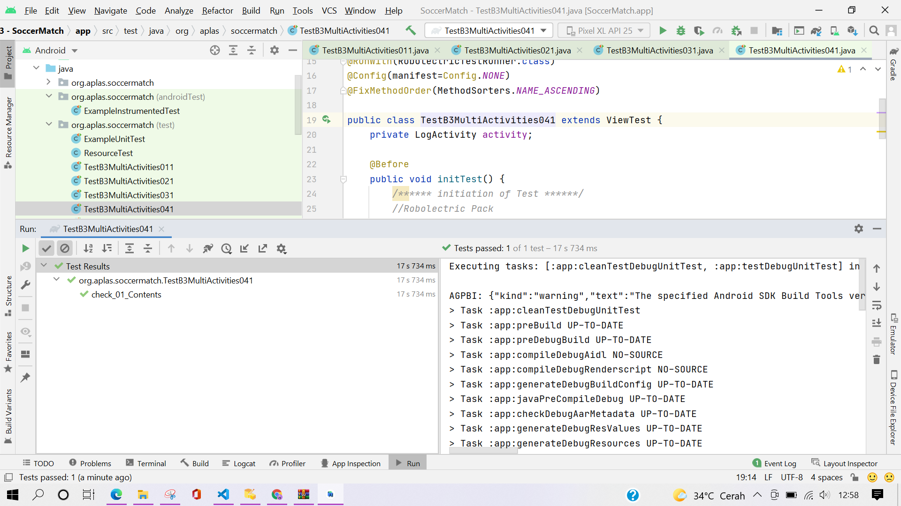
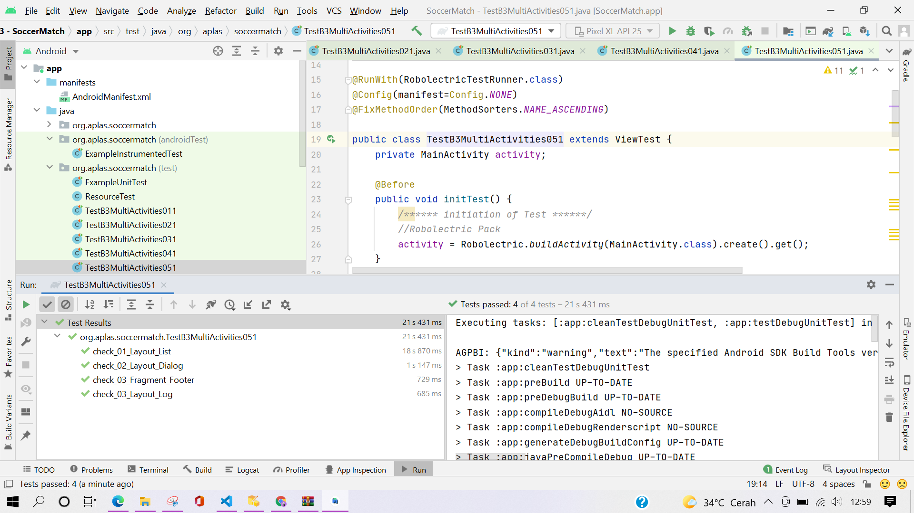
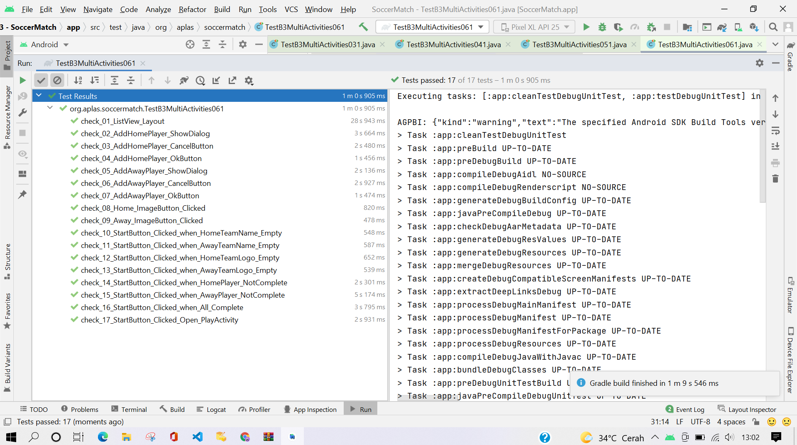
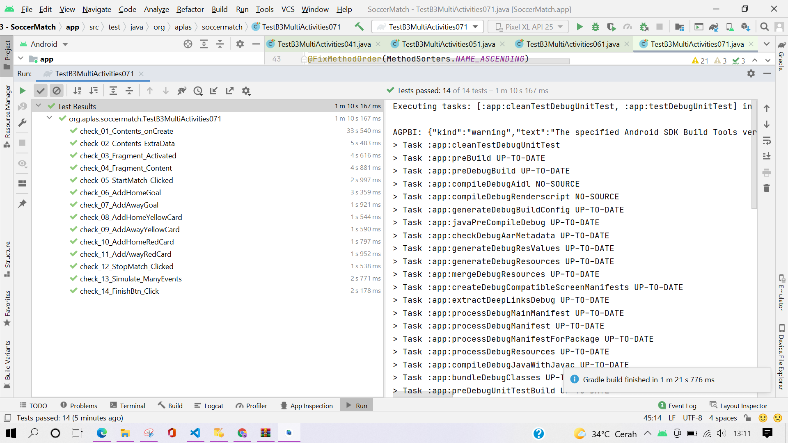
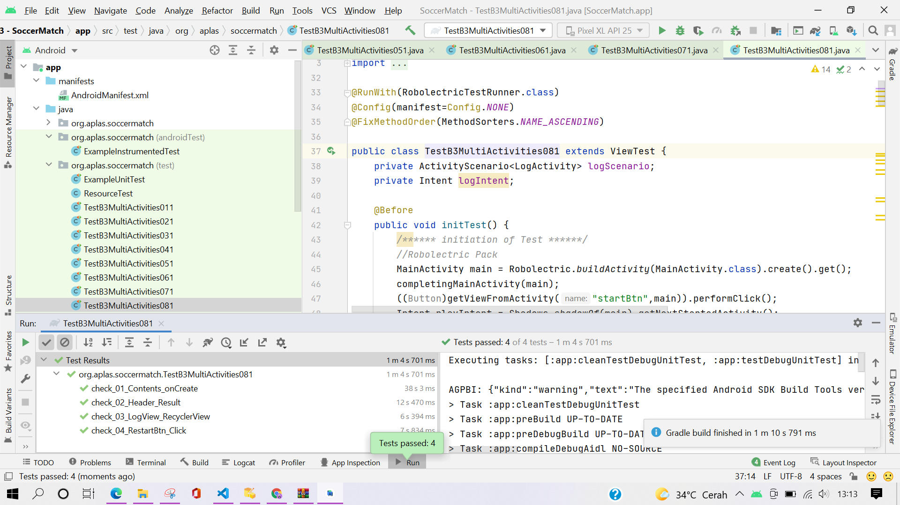
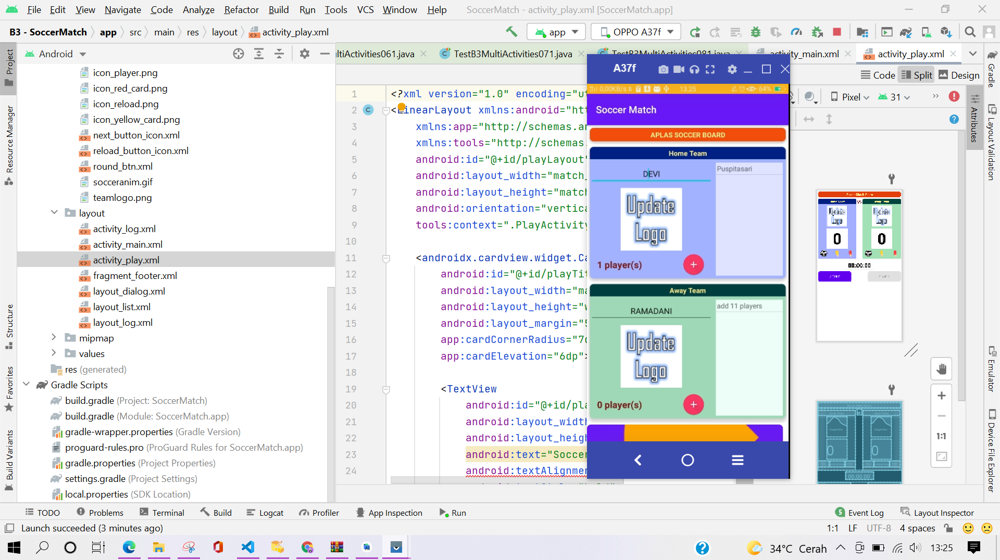
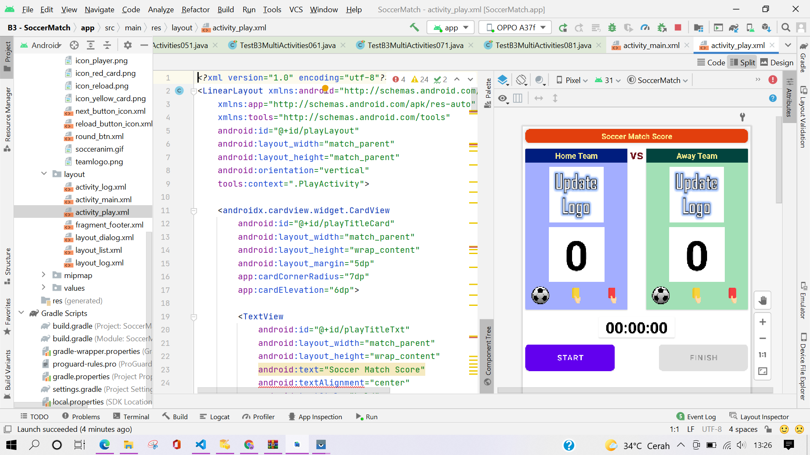

# B3 -TASK GUIDE (B3.01)

## Tujuan Pembelajaran

1. Student will start an Android project to create an Android application that contains several activities entitled Soccer Match. First with project configuration and resource configuration.

## Hasil Praktikum

# B3 -TASK GUIDE (B3.02)

## Tujuan Pembelajaran

1. Student will start to design the Main layout as first layout that contains CardView, ListView, ImageButton, TextView, EditText, and Button.

## Hasil Praktikum

# B3 -TASK GUIDE (B3.03)

## Tujuan Pembelajaran

1. Student will start to design the Play layout as second layout that contains CardView, ImageButton, ImageView, TextView, Fragment Container, and Button.

## Hasil Praktikum

# B3 -TASK GUIDE (B3.04)

## Tujuan Pembelajaran

1. Student will start to design the Log layout as third layout that contains TextView, RecyclerView, and Button.

## Hasil Praktikum

# B3 -TASK GUIDE (B3.05)

## Tujuan Pembelajaran

1. Student will start to design the layout of list, layout of dialog, layout of match log, and layout of footer fragment.

## Hasil Praktikum

# B3 -TASK GUIDE (B3.06)

## Tujuan Pembelajaran

1. Student will start programing for MainActivity. This task will introduce how to handle ListView, open image selector intent, show a dialog, and go to another intent.

## Hasil Praktikum

# B3 -TASK GUIDE (B3.07)

## Tujuan Pembelajaran

1. Student will start programing for PlayActivity. This task will introduce:

- how to gather Intent passing variables,

- how to use Timer with Handler,

- how to use Popup Menu, and

- how to create and access Fragment.

## Hasil Praktikum

# B3 -TASK GUIDE (B3.08)

## Tujuan Pembelajaran

1. Student will start programing for LogActivity. This task will introduce:

- how to gather Intent passing variables,

- how to use RecyclerView,

- how to use View adapter, and

- how to load array as Intent’s extra.

## Hasil Praktikum

# Hasil Akhir

