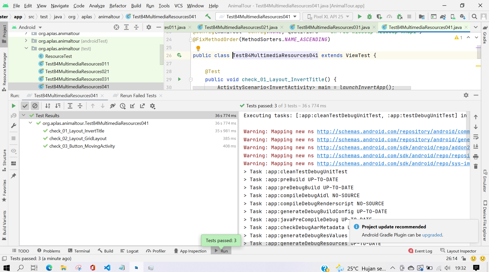
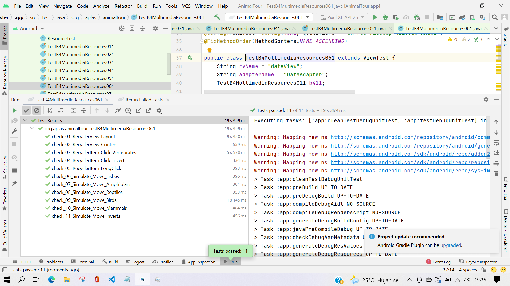

# B4 -TASK GUIDE (B4.01)

## Tujuan Pembelajaran

1. Student will start an Android project to create an Android application that contains several activities entitled Animal Tour. First with project configuration and resource configuration.

## Hasil Praktikum

# B4 -TASK GUIDE (B4.02)

## Tujuan Pembelajaran

1. Student will start to design the Main layout as first layout that contains a RecyclerView with drawable animations.

## Hasil Praktikum

# B4 -TASK GUIDE (B4.03)

## Tujuan Pembelajaran

1. Student will start to design the Media layout as second layout that contains a Video Player, YouTube Player, and ViewFlipper.

## Hasil Praktikum

# B4 -TASK GUIDE (B4.04)

## Tujuan Pembelajaran

1. Student will start to design the Invert layout as third layout that contains a GridLayout to show grid pictures.

## Hasil Praktikum

# B4 -TASK GUIDE (B4.05)

## Tujuan Pembelajaran

1. Student will start to design the SubInvert layout as fourth layout that contains a detail of invertebrate animal.

## Hasil Praktikum

# B4 -TASK GUIDE (B4.06)

## Tujuan Pembelajaran

1. Student will start to write the code for MainActivity which show data in RecyclerView and make them can switch dinamically.

## Hasil Praktikum

# B4 -TASK GUIDE (B4.07)

## Tujuan Pembelajaran

1. Student will start to write the code for MediaActivity which contains Video Player, YouTube Player, and ViewFlipper. Student also will learn how to use gesture.

## Hasil Praktikum

# B4 -TASK GUIDE (B4.08)

## Tujuan Pembelajaran

1. Student will start to write the code for InvertActivity which contains GridLayout for Invertebrates animal picture. Student also will write the code for SubInvertActivity.

## Hasil Praktikum

# Hasil Akhir

