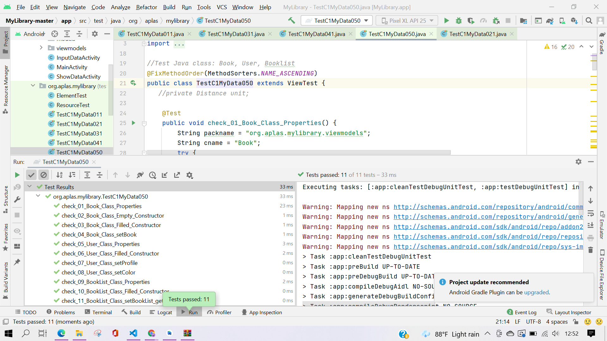

# C1 -TASK GUIDE (C1.01)

## Tujuan Pembelajaran

1. Student will start an Android project to create an Android application that contains several activities entitled MyLibrary. First with project configuration and resource configuration.

## Hasil Praktikum

# C1 -TASK GUIDE (C1.02)

## Tujuan Pembelajaran

1. Student will start to design the Main layout as first layout.

## Hasil Praktikum

# C1 -TASK GUIDE (C1.03)

## Tujuan Pembelajaran

1. Student will start to design the Input Data layout.

## Hasil Praktikum

# C1 -TASK GUIDE (C1.04)

## Tujuan Pembelajaran

1. Student will start to design the Show Data Layout.

## Hasil Praktikum

# C1 -TASK GUIDE (C1.05)

## Tujuan Pembelajaran

1. Student will create share preferences for user’s data and book’s data.

## Hasil Praktikum

# C1 -TASK GUIDE (C1.06)

## Tujuan Pembelajaran

1. Student can create input data and show the data with data binding.

## Hasil Praktikum

# C1 -TASK GUIDE (C1.07)

## Tujuan Pembelajaran

1. Students can create data binding models.

## Hasil Praktikum

# C1 -TASK GUIDE (C1.08)

## Tujuan Pembelajaran

1. Student will create a button to pick color for background.

## Hasil Praktikum

# C1 -TASK GUIDE (C1.09)

## Tujuan Pembelajaran

1. Student will create to check data in “InputDataActivity” page.

## Hasil Praktikum

# C1 -TASK GUIDE (C1.10)

## Tujuan Pembelajaran

1. Student will create effect in some content in “ShowDataActivity” page.

## Hasil Praktikum

# Hasil Akhir

