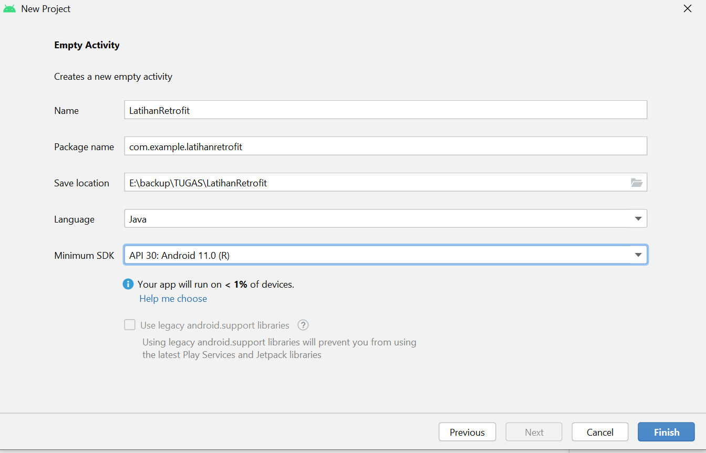
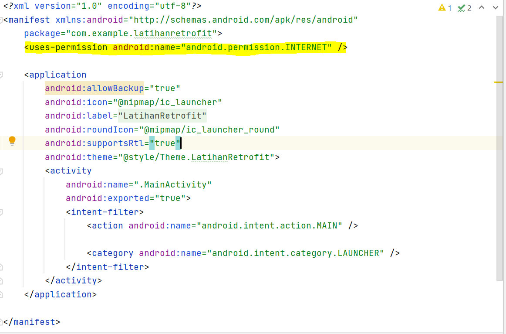
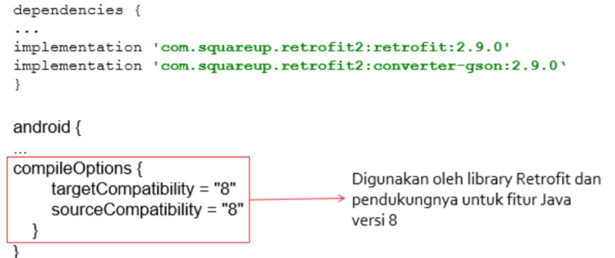
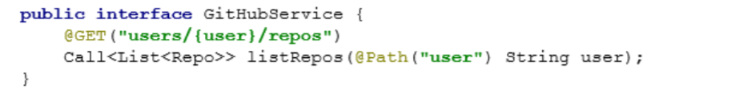
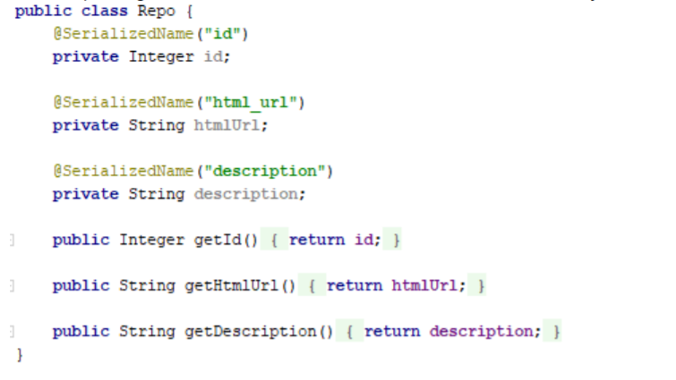
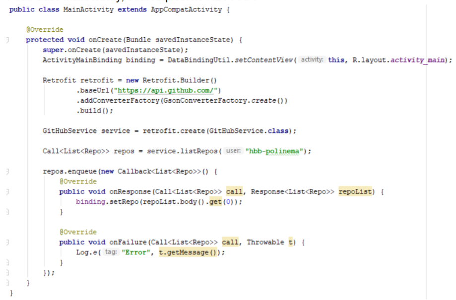
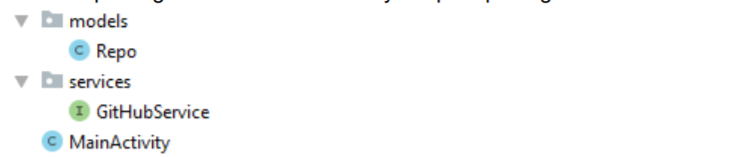

# 10 - Retrofit

## Tujuan Pembelajaran

1. Mahasiswa mampu mengonfigurasi Retrofit pada android;
2. Mahasiswa mampu membuat request ke RESTful API menggunakan Retrofit.

## Hasil Praktikum

1. Silakan buat New Project di Android Studio dengan nama LatihanRetrofit.

    

2. Tambahkan izin koneksi internet di AndroidManifest.xml

    

3. Tambahkan dependencies library Retrofit, converter-gson, dan compileOptions.

    

4. Buatlah package bernama services lalu buat class interface didalamnya.

    

5. Buatlah package bernama models lalu buat class POJO didalamnya.

    

6. Pada class MainActivity, buat request ke REST API

    

7. Struktur packages dan class seharusnya seperti pada gambar berikut.

    

8. Silakan lakukan Run app. Apa yang terjadi? Jika masih ada error, silakan Anda
perbaiki.

### Tantangan

1. Tambahkan inputan dari user agar dapat mengganti username secara dinamis!
2. Tambahkan tampilan loading atau progress bar ketika sedang proses request ke REST
API!
3. Berikan cara memberitahukan kepada user jika gagal request ke REST API selain
menggunakan Toast!