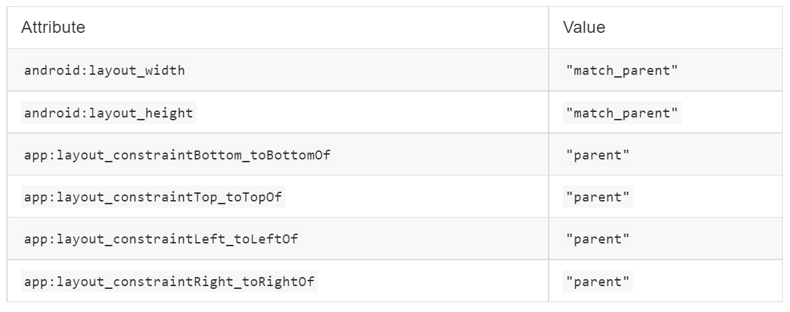
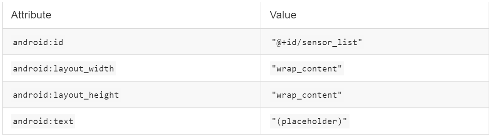
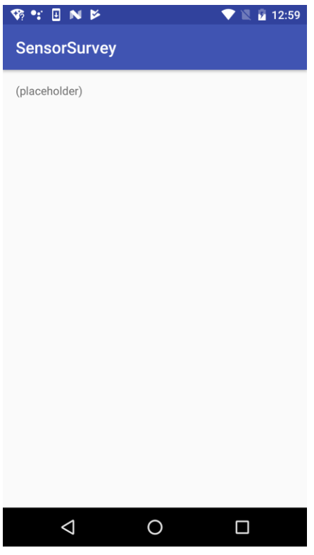

# Rangkuman Materi

## 3.1 Sensor Basics

1. Kategori dan jenis sensor

    memiliki 3 kategori sensor :

    - Motion sensors = giroskop, akselerometer.

    - Environmental sensors = barometer, termometer.

    - Position sensors = magnetometer.

    Jenis sensor yang didukung oleh platform Android

    - Sensor berbasis perangkat keras

        Menurunkan data dengan langsung mengukur properti tertentu

        Contoh : sensor cahaya, sensor jarak, magnetometer, akselerometer.
    
    - Sensor berbasis perangkat lunak

        Berasal dari data satu atau lebih sensor perangkat keras
        
        Contoh: percepatan linier, orientasi.

2. Meniru sensor

    - Accelerometer tab: Uji aplikasi untuk perubahan posisi atau orientasi perangkat.

    - Additional sensors tab: Simulasikan sensor posisi dan lingkungan.

3. Kerangka kerja sensor android

    SENSORMANAGER

    - Akses dan dengarkan sensor

    - Daftar dan batalkan pendaftaran pendengar acara sensor

    - Dapatkan informasi orientasi

    - Menyediakan konstanta untuk akurasi, kecepatan akuisisi data, dan kalibrasi

4. Menemukan sensor dan kemampuan sensor

    - Identifikasi sensor

    - Dapatkan daftar sensor

    - Identifikasi fitur sensor

5. Menangani konfigurasi sensor

    Mendeteksi sensor saat runtime

    - Deteksi sensor saat runtime untuk mematikan fitur aplikasi yang sesuai

    - Gunakan getDefaultSensor() dan berikan konstanta tipe untuk sensor tertentu seperti TYPE_PROXIMITY, TYPE_GYROSCOPE, atau TYPE_GRAVITY

    - Jika ada lebih dari satu sensor untuk jenis tertentu, sistem akan menetapkan satu sebagai default

    - Jika tidak ada tipe itu, metode mengembalikan null
    
6. Memantau peristiwa sensor

    Memantau peristiwa sensor

    - Implementasikan antarmuka SensorEventListener dengan callback

        -> onSensorChanged(SensorEvent acara)

        -> onAccuracyChanged(Sensor sensor, akurasi int)

    - Dapatkan jenis dan nilai sensor dari objek SensorEvent

    - Perbarui aplikasi yang sesuai
Rangkuman : https://google-developer-training.github.io/android-developer-advanced-course-practicals/unit-1-expand-the-user-experience/lesson-3-sensors/3-1-p-working-with-sensor-data/3-1-p-working-with-sensor-data.html

## Task 1. List the available sensors

In this task, you build a simple app that queries the sensor manager for the list of sensors available on the device.

### 1.1 Build the app

1. Create a new Android project. Call it SensorSurvey and use the Empty activity template.

2. Open res/layout/activity_main.xml.

3. Add a margin of 16 dp to the constraint layout

4. Delete the existing TextView.

5. Add a ScrollView element inside the constraint layout. Give it these attributes:

    

    The ScrollView is here to allow the list of sensors to scroll if it is longer than the screen.

6. Add a TextView element inside the ScrollView and give it these attributes:

    

    This TextView holds the list of sensors. The placeholder text is replaced at runtime by the actual sensor list. The layout for your app should look like this screenshot:

    

7. Open MainActivity and add a variable at the top of the class to hold an instance of SensorManager:
    The sensor manager is a system service that lets you access the device sensors.

8. In the onCreate() method, below the setContentView() method, get an instance of the sensor manager from system services, and assign it to the mSensorManager variable:

9. Get the list of all sensors from the sensor manager. Store the list in a List object whose values are of type Sensor:

    The Sensor class represents an individual sensor and defines constants for the available sensor types. The Sensor.TYPE_ALL constant indicates all the available sensors.