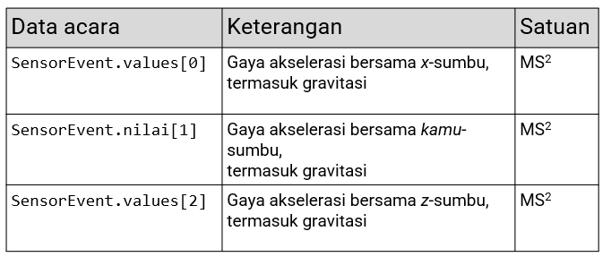

# Rangkuman Materi

## 3.1 Sensor Basics

1. Kategori dan jenis sensor

    memiliki 3 kategori sensor :

    - Motion sensors = giroskop, akselerometer.

    - Environmental sensors = barometer, termometer.

    - Position sensors = magnetometer.

    Jenis sensor yang didukung oleh platform Android

    - Sensor berbasis perangkat keras

        Menurunkan data dengan langsung mengukur properti tertentu

        Contoh : sensor cahaya, sensor jarak, magnetometer, akselerometer.
    
    - Sensor berbasis perangkat lunak

        Berasal dari data satu atau lebih sensor perangkat keras
        
        Contoh: percepatan linier, orientasi.

2. Meniru sensor

    - Accelerometer tab: Uji aplikasi untuk perubahan posisi atau orientasi perangkat.

    - Additional sensors tab: Simulasikan sensor posisi dan lingkungan.

3. Kerangka kerja sensor android

    SENSORMANAGER

    - Akses dan dengarkan sensor

    - Daftar dan batalkan pendaftaran pendengar acara sensor

    - Dapatkan informasi orientasi

    - Menyediakan konstanta untuk akurasi, kecepatan akuisisi data, dan kalibrasi

4. Menemukan sensor dan kemampuan sensor

    - Identifikasi sensor

    - Dapatkan daftar sensor

    - Identifikasi fitur sensor

5. Menangani konfigurasi sensor

    Mendeteksi sensor saat runtime

    - Deteksi sensor saat runtime untuk mematikan fitur aplikasi yang sesuai

    - Gunakan getDefaultSensor() dan berikan konstanta tipe untuk sensor tertentu seperti TYPE_PROXIMITY, TYPE_GYROSCOPE, atau TYPE_GRAVITY

    - Jika ada lebih dari satu sensor untuk jenis tertentu, sistem akan menetapkan satu sebagai default

    - Jika tidak ada tipe itu, metode mengembalikan null
    
6. Memantau peristiwa sensor

    Memantau peristiwa sensor

    - Implementasikan antarmuka SensorEventListener dengan callback

        -> onSensorChanged(SensorEvent acara)

        -> onAccuracyChanged(Sensor sensor, akurasi int)

    - Dapatkan jenis dan nilai sensor dari objek SensorEvent

    - Perbarui aplikasi yang sesuai

## 3.2 Motion and position sensors

1. Ikhtisar sensor gerak dan posisi

    Gerakan = memantau pergerakan.

    Posisi = memantau posisi perangkat di ruang masing-masing.

    - Sistem Koordinat 

        -> Sistem koordinat perangkat = menggunakan sistem koordinat perangkat relatif terhadap perangkat.

        Contoh : Akselerometer

        -> Sistem koordinat bumi = menggunakan sistem koordinat Bumi relatif terhadap permukaan Bumi.

        Contoh : Magnetometer

2. Menentukan orientasi perangkat

    **Komponen Orientasi**

    - Azimut = Sudut antara arah kompas perangkat dan utara magnet 

    - Melempar = Sudut antara bidang yang sejajar dengan layar perangkat dan bidang yang sejajar dengan tanah

    - Gulungan = Sudut antara bidang yang tegak lurus dengan layar perangkat dan bidang yang tegak lurus dengan tanah

    **Metode SensorManager**

    - getRotationMatrix() menghasilkan matriks rotasi dari akselerometer dan sensor medan geomagnetik -> Menerjemahkan data sensor dari koordinat perangkat ke koordinat Bumi

    - getOrientasi() menggunakan matriks rotasi untuk menghitung sudut orientasi perangkat

3. Memahami rotasi perangkat

    - Transformasikan koordinat untuk rotasi

        Jika aplikasi menggambar tampilan berdasarkan data sensor:

        -> Layar atau sistem koordinat aktivitas berputar dengan perangkat
        
        -> Sistem koordinat sensor tidak berputar
        
        -> Perlu untukmengubah koordinat sensor menjadi koordinat aktivitas

    - Menangani perangkat dan rotasi aktivitas

        -> Orientasi perangkat kueri dengan getRotationMatrix() 
        
        -> Petakan ulang matriks rotasi dari data sensor ke koordinat aktivitas dengan remapCoordinateSystem()

4. Menggunakan sensor gerak

    Pantau gerakan perangkat seperti kemiringan, goyang, rotasi, ayunan.

    - Sensor gerak

        -> masukkan pengguna langsung relatif terhadap perangkat/aplikasi (kemudi mobil dalam permainan).

        -> Gerakan perangkat relatif terhadap Bumi (perangkat bersama Anda saat Anda mengemudi).

            (Sensor gerak digunakan dengan sensor lain untuk menentukan posisi perangkat relatif terhadap Bumi)

    - Akselerometer

        -> TYPE_ACCELEROMETER mengukur percepatan di sepanjang 3 sumbu perangkat (x, kamu, z) termasuk gravitasi 
        
        -> Akselerasi tanpa gravitasi: gunakan TYPE_LINEAR_ACCELERATION 
        
        -> Gaya gravitasi tanpa percepatan: gunakan TYPE_GRAVITY
        
        -> TYPE_GYROSCOPE mengukur laju rotasi (radian/detik)
        
        -> Untuk perhitungan lihat Acara Sensor nilai-nilai

    - Data acara akselerometer

        

6. Menggunakan sensor posisi

    - Geomagnetik

        -> TYPE_MAGNETIC_FIELD mengukur kekuatan medan magnet di sekitar perangkat pada masing-masing 3 sumbu (x, kamu, z), termasuk medan magnet bumi.

        -> Unit sudah masuk mikrotesla (uT).

        -> Temukan posisi perangkat sehubungan dengan dunia luar (kompas).

    - Orientasi

        -> TYPE_ORIENTATION tidak digunakan lagi di API 8

        -> Untuk orientasi perangkat yang akurat (Pilih satu):
        - Menggunakan getRotationMatrix() dan getOrientasi(), atau

        - Gunakan sensor rotasi-vektor dengan TYPE_ROTATION_VECTOR

## 7.1 Layanan Lokasi

1. Gambaran

    Ponsel = SELULER

    Pengguna bergerak dan pergi ke berbagai tempat

    - Menggunakan lokasi di aplikasi Anda

    - Dapatkan lokasi perangkat

2. Menyiapkan layanan Google Play

    Instal Google Repository di Android Studio

    -> Pilih Alat > Android > Manajer SDK
    
    -> Pilih Alat SDK tab
    
    -> Mengembangkan Dukungan Repositori
    
    -> Pilih Google Repositori dan klik oke

3. Izin lokasi

    - Pengguna memberikan atau menolak akses ke lokasi mereka untuk setiap aplikasi
    
    - Pengguna dapat mengubah izin akses kapan saja
    
    - Aplikasi Anda dapat meminta pengguna untuk memberikan izin untuk menggunakan lokasi

4. Dapatkan lokasi perangkat

    - FusedLocationProviderClient = untuk meminta lokasi terakhir yang diketahui.

        -> FusedLocationProviderClient flpClient =  LocationServices.getFusedLocationProviderClient(konteks);

5. Geocoding dan geocoding terbalik

    - Kode geografis : Ubah alamat jalan yang dapat dibaca manusia menjadi garis lintang/bujur.

    - Kode geografis terbalik : Ubah lat/long menjadi alamat jalan yang dapat dibaca manusia.

6. Membuat sebuah permintaan lokasi objek

    - Mendapatkan pembaruan lokasi

    - Parameter Permintaan Lokasi

        -> setInterval(): Menyetel seberapa sering aplikasi Anda membutuhkan pembaruan
        
        -> setFastestInterval(): Menetapkan batas kecepatan pembaruan untuk mencegah kedipan/limpahan data
        
        -> setPrioritas(): Menetapkan prioritas dan sumber permintaan

7. Bekerja dengan pengaturan pengguna

    - Pengguna dapat mengontrol keseimbangan antara akurasi dan konsumsi daya

    - Aplikasi Anda dapat:

        -> Deteksi pengaturan perangkat

        -> Minta pengguna untuk mengubahnya

    - Langkah-langkah untuk memeriksa pengaturan perangkat

        -> Membuat PermintaanPengaturan Lokasi obyek
    
        -> Membuat PengaturanKlien obyek
        
        -> Menggunakan periksaLocationSettings() untuk melihat apakah pengaturan perangkat cocok Permintaan Lokasi

        -> Menggunakan OnFailureListener untuk menangkap ketika pengaturan tidak cocok Permintaan Lokasi

8. Meminta pembaruan lokasi

    - Menggunakan Permintaan Lokasi dengan FusedLocationProviderClient 
    
    - Akurasi lokasi ditentukan oleh:
        -> Penyedia lokasi yang tersedia (jaringan dan GPS)
        
        -> Izin lokasi diminta
        
        -> Opsi diatur dalam permintaan lokasi

    - Langkah-langkah untuk memulai pembaruan lokasi

        -> Membuat Permintaan Lokasi obyek 
        
        -> Mengesampingkan LocationCallback.onLocationResult()

        -> Menggunakan requestLocationUpdates() pada FusedLocationProviderClient untuk memulai pembaruan rutin

## 8.1 Places API

1. Ikhtisar dan penyiapan API

2. Menyiapkan izin

3. Menggunakan detail tempat

4. Menggunakan Pemilih Tempat UI

5. Mendapatkan tempat terdekat

6. Menggunakan TempatPelengkapanOtomatis melayani

# PRAKTIKUM 

https://google-developer-training.github.io/android-developer-advanced-course-practicals/unit-1-expand-the-user-experience/lesson-3-sensors/3-1-p-working-with-sensor-data/3-1-p-working-with-sensor-data.html

## Task 1. List the available sensors

In this task, you build a simple app that queries the sensor manager for the list of sensors available on the device.

### 1.1 Build the app

1. Create a new Android project. Call it SensorSurvey and use the Empty activity template.

2. Open res/layout/activity_main.xml.

3. Add a margin of 16 dp to the constraint layout

4. Delete the existing TextView.

5. Add a ScrollView element inside the constraint layout. Give it these attributes:

    

    The ScrollView is here to allow the list of sensors to scroll if it is longer than the screen.

6. Add a TextView element inside the ScrollView and give it these attributes:

    

    This TextView holds the list of sensors. The placeholder text is replaced at runtime by the actual sensor list. The layout for your app should look like this screenshot:

    

7. Open MainActivity and add a variable at the top of the class to hold an instance of SensorManager:
    The sensor manager is a system service that lets you access the device sensors.

8. In the onCreate() method, below the setContentView() method, get an instance of the sensor manager from system services, and assign it to the mSensorManager variable:

9. Get the list of all sensors from the sensor manager. Store the list in a List object whose values are of type Sensor:

    The Sensor class represents an individual sensor and defines constants for the available sensor types. The Sensor.TYPE_ALL constant indicates all the available sensors.